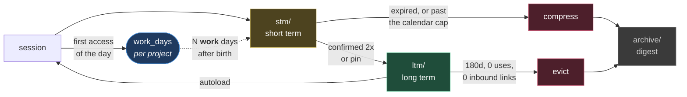

# Memory — home

Wiki of the persistent memory. Every entry is a Markdown file; this page is the index, regenerated by `mem graph`.



## Map

| Area | Content |
|---|---|
| [[global]] | global policy, root of the inheritance chain |
| [[inheritance]] | how policies resolve along the tree |
| [[_graph]] | project graph and their cross-links |
| `ltm/` | stable facts: user, feedback, decisions, references |
| `stm/` | per-project working notes, with an expiry |
| `archive/` | digests compacted by the garbage collector |

## Index

<!-- mem:index:start -->

### Policies

- [Policy · Persistent memory](projects/claude-memory/policy.md) — `claude-memory-policy`
- [Global policy](policies/global.md) — `global`
- [Policy inheritance](policies/inheritance.md) — `inheritance`

### User

- [Identity](ltm/user/identity.md) — `identity`

### Feedback

- [Commit conventions](ltm/feedback/commit-conventions.md) — `commit-conventions`
- [Which git identity to use](ltm/feedback/git-identity.md) — `git-identity`
- [One branch per machine](ltm/feedback/machine-branches.md) — `machine-branches`
- [Initiative and scope when writing memory](ltm/feedback/memory-hygiene.md) — `memory-hygiene`
- [Division of labour on git](ltm/feedback/push-policy.md) — `push-policy`
- [Response style](ltm/feedback/response-style.md) — `response-style`
- [Sequential execution](ltm/feedback/sequential-execution.md) — `sequential-execution`
- [The workspace is disposable](ltm/feedback/workspace-scratch.md) — `workspace-scratch`

### Decisions

- [Autoload strategy](ltm/decisions/autoload-strategy.md) — `autoload-strategy`
- [Memory architecture](ltm/decisions/memory-architecture.md) — `memory-architecture`
- [STM notes expire in work days, not calendar days](ltm/decisions/stm-work-counter.md) — `stm-work-counter`

### References

- [Permanent context](AUTOLOAD.md) — `AUTOLOAD`
- [Memory — home](MEMORY.md) — `MEMORY`
- [Project graph](projects/_graph.md) — `_graph`
- [Links · Persistent memory](projects/claude-memory/links.md) — `claude-memory-links`

### Projects

- [Persistent memory](projects/claude-memory/project.md) — `claude-memory`

_Active STM: 0 notes · updated 2026-09-14_

<!-- mem:index:end -->

## Commands

```bash
python3 ~/.claude-memory/bin/mem.py search <term>      # tag, name, title, body
python3 ~/.claude-memory/bin/mem.py tags [filter]      # closed vocabulary
python3 ~/.claude-memory/bin/mem.py project [<slug>] [--no-tick]   # active project; --no-tick writes nothing
python3 ~/.claude-memory/bin/mem.py load      # session context
python3 ~/.claude-memory/bin/mem.py new stm <name> --scope <project>
python3 ~/.claude-memory/bin/mem.py confirm stm/<project>/<file>.md
python3 ~/.claude-memory/bin/mem.py promote stm/<project>/<file>.md --type decisions
python3 ~/.claude-memory/bin/mem.py gc --apply
python3 ~/.claude-memory/bin/mem.py index && python3 ~/.claude-memory/bin/mem.py graph
```
