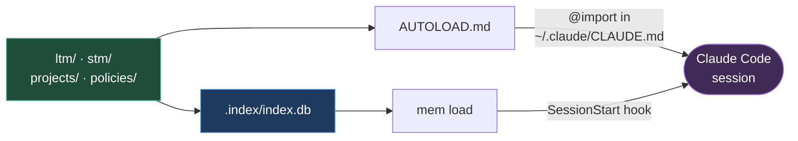

# claude-memory

Cross-session persistent memory for Claude Code. A Markdown wiki as the single source of truth, SQLite as a regenerable index.

Claude Code forgets everything between sessions. This repo is one answer to that: facts live as Markdown files, a small stdlib-only CLI indexes them, and two autoload layers push the relevant ones back into every new session.

## Principles

1. **Markdown-first** — every fact is a readable, diffable `.md` file. The database holds no original information.
2. **One fact, one file** — atomicity is what makes merges, GC and pinpoint reuse possible.
3. **Wiki** — files link to each other with `[[wikilinks]]`; diagrams are Mermaid, generated from the index.
4. **Cross-platform** — Linux, macOS, Windows. No symlinks, no external dependencies, Python stdlib only.
5. **Never destructive** — the GC archives, it does not delete. History stays in git.

## How it works



Three autoload layers, deliberately different:

| Layer | Mechanism | Content |
|---|---|---|
| 1 — static | `@AUTOLOAD.md` imported from `~/.claude/CLAUDE.md` | invariants that must survive even if the CLI fails |
| 2 — session | `SessionStart` hook running `mem load` | effective policy for the cwd, active project, recent notes |
| 3 — prompt | `UserPromptSubmit` hook running `mem project` | the project inferred from what you just typed |

Layer 1 exists because layer 2 can break. If the hook fails, the rules still load.

**Layer 3 exists because layer 2 runs too early.** `SessionStart` fires before any prompt exists, so it can only look at the working directory. If you start your sessions from a scratch directory rather than inside the project — which is a common way to work — the cwd matches nothing and the project layer never activates at all. Worse, it never ticks `work_days`, so STM notes on that project stop expiring on work and fall back to the calendar cap, defeating the mechanism that counter was built for.

Layer 3 resolves the project from the prompt text instead, matching `aliases` declared in `projects/<slug>/project.md`:

```yaml
fs_path: ~/dev/acme/api
aliases: [acme, acme-api, acme.cloud]
```

It injects only when the project *changes*, stays silent when nothing matches, and when two projects are named together it says so and injects nothing rather than guessing. A slug that is also an ordinary word will eventually produce a false positive, so the injected header always states what it was inferred from — one weak match reads differently from four. `mem project <slug>` forces it by hand.

## Structure

```
.
├── MEMORY.md              wiki home + LTM index (autoloaded)
├── AUTOLOAD.md            what enters every session's context
├── bin/mem.py             the CLI (stdlib only)
├── install/               setup.sh (unix) / setup.ps1 (windows)
├── policies/              inheritance chain, rooted in global.md
├── projects/              one dir per tracked project + _graph.md
├── ltm/                   long-term memory, by type
├── stm/                   short-term memory, per project, with a TTL
├── archive/               digests compacted by the GC
└── .index/index.db        SQLite index (git-ignored, regenerable)
```

## Memory lifecycle

A note is born in `stm/<project>/`. It expires in **work days on that project**, not calendar days — a project untouched for two weeks has produced no information that invalidates its notes. Confirm a note twice (`mem confirm`) and it earns promotion to `ltm/`. Expired notes are compacted into `archive/`, never deleted.

See [[stm-work-counter]] for why the counter exists and where it bites.

## Usage

```bash
python3 bin/mem.py search <term>   # find notes by tag, name, title and body
python3 bin/mem.py tags            # the tag vocabulary, with counts
python3 bin/mem.py index           # rebuild the index from Markdown
python3 bin/mem.py graph           # regenerate the Mermaid diagrams and MEMORY.md
python3 bin/mem.py gc              # garbage collector, dry run
python3 bin/mem.py gc --apply      # run sweep, compress, evict
python3 bin/mem.py scope .         # effective policy for the current directory
python3 bin/mem.py doctor          # broken links, invalid frontmatter, orphans
```

## Finding things

`search` ranks matches in four tiers — exact tag, name, title, body — and prints the matching body line so you can tell a real hit from an incidental one.

```bash
python3 bin/mem.py search provisioning            # everything, body included
python3 bin/mem.py search provisioning --meta     # metadata only, no body scan
python3 bin/mem.py search --tag git --tag github  # notes carrying both tags
python3 bin/mem.py search deploy --type decision  # filter by note type or --scope
```

**The body is searched by default, and that is deliberate.** Tags decay: they get written in the moment, in whatever words were on hand, and nobody goes back to reconcile them. A memory whose only index is its tags is one synonym away from silence — searching `provisioning` must not miss a note tagged `peer-provisioning`.

`tags` is the repair tool for that. It prints the whole vocabulary with counts, so you can see the synonyms and the near-duplicates, and it takes a filter:

```bash
python3 bin/mem.py tags prov      # which forms of this term already exist?
```

Generated files (`MEMORY.md`, `projects/_graph.md`) are excluded from body search: being indexes, they contain every title and would match anything.

### The vocabulary is closed

`policies/global.md` declares which tags may exist, under `memory.tags`. Anything outside that list is a problem for `doctor`, which names the nearest tag already in use:

```
- tag `memoria` is outside the vocabulary in `global.md`, nearest is `memory`
```

That check is the whole point. Without it the list would be a convention to remember, and a vocabulary always grows back: the memory this template came from had reached **150 tags across 86 notes, 110 of them used exactly once**, before it was cut to 23. Adding a tag means editing the list, deliberately.

Two rules keep it small:

- **A tag earns its place by grouping notes that share no words.** If the term is already in the title or body, `search` finds the note without it. Chip part numbers, tool names and one-off topics are labels, not indexes.
- **Project names are not tags.** `scope: project:acme` already says it, and `search --scope` already filters on it. Tagging `acme` on top duplicates a field the index enforces.

Scaffolding is not tagged either: `policy.md`, `project.md`, `links.md` and the generated files exist once per project and group nothing, so `doctor` leaves them out of the untagged count instead of reporting them forever.

References: [[MEMORY]] · [[policies/global]] · [[projects/_graph]]

## Installation

Unix: `sh install/setup.sh` · Windows: `powershell -File install/setup.ps1`

The installer writes `~/.claude/CLAUDE.md` (static autoload) and the two hooks in `~/.claude/settings.json`, and points `core.hooksPath` at `install/hooks`. It **never** writes your git identity — that is yours to configure. The repo itself contains nothing machine-specific.

### ⚠️ On Windows: hook commands run under bash, not cmd.exe

A hook command is executed by `/usr/bin/bash`, where a backslash is an escape character. An unquoted `C:\Python314\python.exe` becomes `C:Python314python.exe` — `command not found`, exit 127. And because these hooks are non-blocking, **the failure appears nowhere**: the session starts normally, just without any live memory.

That is why the installer emits this form, and never `sys.executable`:

```json
"command": "python \"$HOME/.claude-memory/bin/mem.py\" load"
```

Interpreter from `PATH`, forward slashes, quoted, and `$HOME` rather than `~` — a tilde inside double quotes does not expand.

This bit twice in the project it came from, the second time silently for hours. `mem doctor` now reads `settings.json` and reports a hook command containing backslashes, so the next occurrence is loud. To check a hook by hand, read the command **from the file** and run it, rather than retyping it:

```bash
cmd=$(python -c "import json,pathlib; print(json.loads(pathlib.Path.home().joinpath('.claude/settings.json').read_text(encoding='utf-8'))['hooks']['SessionStart'][0]['hooks'][0]['command'])")
bash -c "$cmd"; echo "EXIT=$?"
```

**The alarm signal:** the invariant rules arrive at startup but the active project and the long-term facts do not. That means only the static `AUTOLOAD.md` import got through and the hook died.

## Fork & customize

This repo ships with one worked example of a memory: the notes under `ltm/`, `policies/global.md` and `AUTOLOAD.md` describe how *one* person works. They are there so the machinery is legible, not because you should adopt them.

After forking, in this order:

1. **`policies/global.md`** — replace `git.identity.github.*` with your handle and email, and rewrite the whole policy block to match how you work. The keys are free-form: `mem` merges whatever you declare, it does not validate a schema.
2. **`AUTOLOAD.md`** — this is what lands in *every* session. Rewrite the identity and invariants sections; keep it under the `autoload_budget_kb` cap (8 KB by default), which `mem doctor` enforces.
3. **`ltm/feedback/` and `ltm/user/identity.md`** — delete what does not apply and write your own. Every file here is an example, including `machine-branches.md`, which describes a one-branch-per-machine model you may not want.
4. **`projects/`** — delete `projects/claude-memory/` or repoint it, then register your own with `mem new project <slug>` and set each `fs_path`.
5. `python3 bin/mem.py index && python3 bin/mem.py graph && python3 bin/mem.py doctor`

`mem doctor` is the check that matters: it catches broken wikilinks, missing frontmatter, projects pointing at paths that do not exist, and an `AUTOLOAD.md` over budget.

### Things worth knowing before you commit to this

- **`main` is frozen by default.** `install/hooks/` refuses commits and pushes to `main`, on the assumption that each machine lives on its own branch and branches never merge. If that model is not yours, drop `core.hooksPath` and rewrite [[machine-branches]] — the protection is local-only anyway, so a clone without `setup.py` does not have it.
- **The GC never runs on its own.** `mem gc` is manual, and `--apply` is required to move anything. The only automation is `mem load` at session start.
- **`repo_visibility`** in `policies/global.md` gates what is considered safe to record. Set it to `private` if your fork's upstream is private, and read [[memory-hygiene]] before writing anything about client work into a public repo.
- **A command `AUTOLOAD.md` does not name effectively does not exist.** A session knows only what is injected into it; nobody asks `--help` about a command they do not know is there. In the project this came from, `search`, `tags` and `--no-tick` were each committed and working while going unused, because the autoloaded context never mentioned them — every session fell back on something worse, with no error to show for it. Adding a command is finished when `AUTOLOAD.md` names it, in the place where it is needed, not at the bottom of a list. `MEMORY.md` does not count: it is never injected.

## License

MIT — see [LICENSE](LICENSE).
