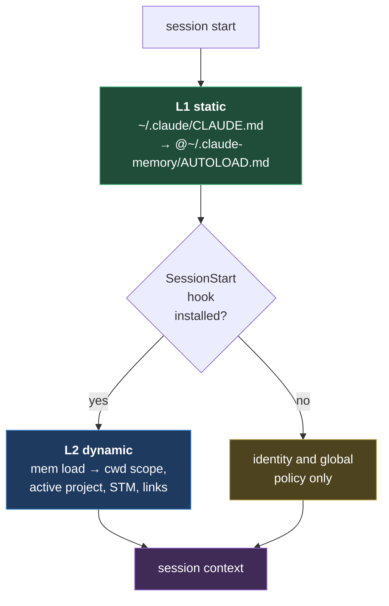

# Autoload strategy

Two independent layers, so that the dynamic one can fail without losing the memory.

| Layer | Mechanism | Portability |
|---|---|---|
| L1 | static import in `~/.claude/CLAUDE.md` | identical on Linux/Windows/macOS, no executable |
| L2 | `SessionStart` hook → `mem load` | command written per-OS by the installer (`python3` vs `python`) |

**Why two layers:** the `~/.claude/` path exists the same way on every system, so L1 is portable unconditionally. The hook instead depends on the shell and on the Python binary's name, so it lives in `~/.claude/settings.json` — a machine-local file, not versioned in the repo. The repo stays OS-agnostic; only `install/setup.sh` and `install/setup.ps1` differ.

**No symlinks** towards `~/.claude/projects/*/memory`: on Windows they require elevated privileges. Explicit imports are used instead.

See also [[memory-architecture]] · [[global]]
