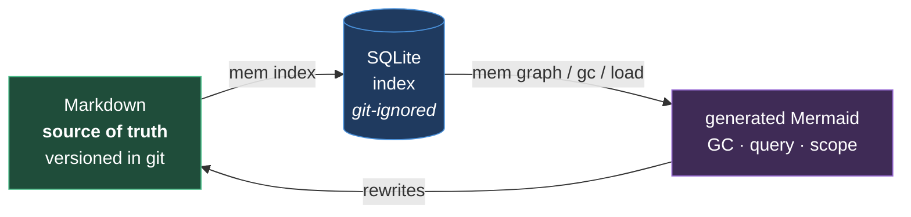

# Memory architecture

Decision of 2026-08-29. Repo `~/.claude-memory`, upstream managed by the user.

**Choice: Markdown wiki + SQLite index.**

## Rejected alternatives

| Option | Reason for rejection |
|---|---|
| Flat files only, manual GC | no querying over the links, whole index in context every session |
| Hook resolver without a Markdown wiki | the user wants all documentation as a Markdown + Mermaid wiki |
| DB as the source of truth | git diffs become unreadable and the memory is no longer inspectable by hand |

## Fixed constraints

- the DB never holds original information: `mem index` rebuilds it from scratch
- the GC **archives**, it does not delete — and history stays in git regardless
- Python stdlib only, no symlinks, `~`-relative paths: the repo must behave identically on Windows

⚠️ The calendar TTL described here was superseded on 2026-08-30: STM notes expire in
**work days on the project**. See [[stm-work-counter]].

See also [[global]] · [[inheritance]] · [[autoload-strategy]] · [[stm-work-counter]]
