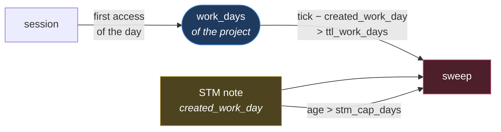

# STM notes expire in work days, not calendar days

Decision of 2026-08-30. Replaces the uniform calendar TTL from [[memory-architecture]].

## The problem

The TTL counted calendar days, but an STM note's relevance decays with **sessions on the
project**. The two axes coincide only on the main project.

| | Daily project | Project opened one day every 2-3 weeks |
|---|---|---|
| 14 days were worth | ~10 working days | often **zero** |
| The code under the note | moves, including at other hands | still between one session and the next |
| Whoever rereads it | someone holding the context | someone picking it up cold |

On the occasional project the note is worth **more**, decays **more slowly**, and had the
**shortest** useful window: the GC archived exactly the note that was needed.

## The solution

A `work_days` counter per project, in the frontmatter of `projects/<slug>/project.md`,
incremented by `mem load` on the first access of each day. Global notes use the counter in
`MEMORY.md`, which advances on every session anywhere.

The note records the tick at birth and is **never rewritten**: the counter sits on the
project, not on the note. One write per day per project, not one per session per note.

## Why the calendar cap stays

`stm_cap_days` expires the note regardless, with the counter frozen. Without it, a note on a
project dormant for a year would be **immortal** precisely while the code shifts underneath
it. Whichever of the two arrives first wins.

## What varies per project, and what does not

**Only the cap.** `stm_work_ttl` stays the same everywhere: the rarity of sessions is already
absorbed by the counter, and stretching the TTL too would count the same correction twice.
On a project opened one day every two or three weeks the cap must instead be loosened
(365 instead of 180), because at 180 it would die **before** the counter — after ~8 working
days — putting the calendar back in charge through the back door.

## Rejected alternatives

| Option | Reason for rejection |
|---|---|
| Longer calendar TTL on occasional projects | treats the symptom: the right threshold depends on a cadence that changes |
| Counter on the individual note | forces `load` to rewrite every note on every session |
| `stm_ttl_days` per project in the policies | **did not work**: `cmd_gc` resolved `resolve_policy(ROOT)`, so every project override was inert |

## Traps found while implementing

- `cmd_gc` resolved the policy on `ROOT`, not on the note's project. STM thresholds now
  resolve per note, via the project's `fs_path`: `resolve_policy` reasons over paths, not slugs.
- **`promote_after: 2` was not implemented by a single line of code**: the confirmation count
  lived only in the discipline of whoever was working, and a reconfirmed note expired anyway.
  Fixed with `mem confirm <note>`, which increments `confirmations` in the frontmatter; once
  the threshold is reached `mem doctor` flags the promotion. A confirmation stays a
  **declared act**: the fact that `load` injects a note does not mean the fact still holds.
- `compress_threshold_files` was only printed: with `--apply` compaction happened regardless,
  threshold or not. **Removed**, not implemented: expired notes have to be archived in any
  case and the digest stays readable even with a single note, so there was no sensible
  behaviour to hang off the threshold.
- No automation runs `gc`, `index` or `graph`: the only active hook is `mem load` on
  SessionStart.

See also [[memory-architecture]] · [[memory-hygiene]] · [[global]]
