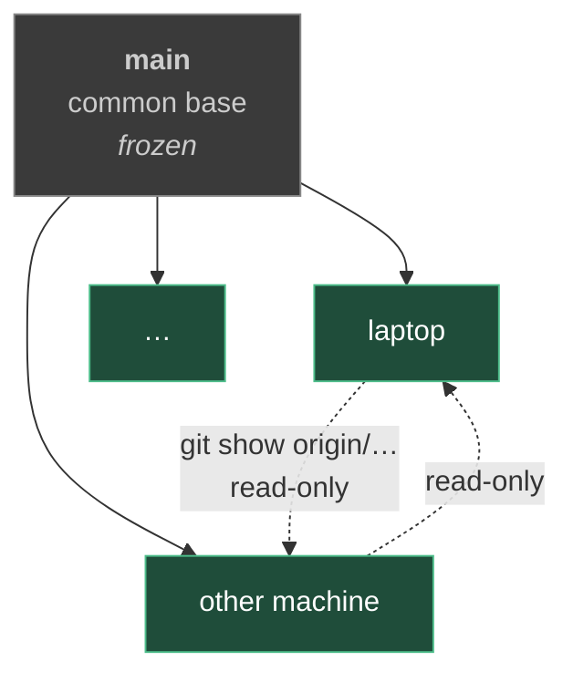

# One branch per machine

Every machine has **its own branch** in the memory repo, created from `main`. That is where commits go, always.

`main` is the **common, frozen base**: once the branches exist it takes no further commits or pushes.



Branches are **permanent forks**: they never come back into `main` and never merge into each other. No merges, no rebases, no integration PRs.

## ⚠️ Code does not follow the rule that data follows

The rule above is designed for the **memory**, which diverges by construction: every machine has its own clients, its own paths, its own facts. For `bin/` and `install/` divergence is not expected, it is a **defect**: they are software, and [[global]] binds them to `portability.targets: [linux, windows, macos]`.

| What | Divergence | Rule |
|---|---|---|
| `ltm/` `stm/` `projects/` `policies/` `AUTOLOAD.md` | expected and healthy | never merge, each machine its own |
| notes describing the repo's workflow (this one) | defect | must converge on `main` |
| `bin/` `install/` | defect | must converge on `main` |

**Observed in the field:** one machine was running a `mem.py` stuck at `main`, missing two fixes — one for CRLF, one for the index — corrected on another branch days earlier and never delivered anywhere else. Six code commits had stayed on a single branch.

Since then a fix in `bin/` or `install/` is carried to `main` with `git commit --no-verify`, taking **only** the code files, the universal policy fields and **the notes describing this repo's workflow** — this one included. Those ride along because `main` is the base every new machine is born from: leaving them incomplete there guarantees the next machine repeats the mistake. Never, on the other hand, `work_days` counters, scratch paths or client-project policies, which do not even exist on `main` — and whose wikilinks would come out broken under `mem doctor`.

Carrying something to `main` **propagates nothing on its own**. Every other machine realigns by hand:

```bash
git -C ~/.claude-memory fetch origin
git -C ~/.claude-memory checkout origin/main -- bin/ install/
```

## ⚠️ Before committing on `main`, realign it to `origin/main`

`main` is never checked out. `git fetch` updates `origin/main`, but **the local `main` ref stays exactly where it was**, possibly for months. Committing on top of it produces a commit on a stale base, and the push is rejected as divergent.

**Observed on 2026-09-14:** the local `main` was stuck at 30 August and did not contain `cli()`, which had been on `origin/main` since then. The helper was carried over a second time from the machine branch, believed missing, duplicating its content; the push was rejected and the commit redone on the right base.

⚠️ **Counting outgoing commits does not reveal the problem.** `git log origin/main..main` says how many you have **ahead**, not how many you are **missing**: with a stale local ref it answers `1` and everything looks fine. You need the divergence, which has two numbers:

```bash
git -C ~/.claude-memory fetch origin
git -C ~/.claude-memory rev-list --left-right --count origin/main...main   # <missing> <ahead>
git -C ~/.claude-memory branch -f main origin/main                         # if <missing> is not 0
```

A worktree avoids moving the working tree — which normally carries at least an uncommitted `work_days` counter:

```bash
git -C ~/.claude-memory worktree add /tmp/wt-main main
git -C /tmp/wt-main checkout <machine-branch> -- bin/ install/
git -C /tmp/wt-main commit --no-verify
git -C ~/.claude-memory worktree remove /tmp/wt-main
```

## How the `main` lock is enforced

Two versioned hooks in `install/hooks/`, enabled by `install/setup.py` through
`core.hooksPath` (local config, so each machine sets it once):

| Hook | Blocks |
|---|---|
| `pre-commit` | commits with `main` as the current branch |
| `pre-push` | pushes writing to `refs/heads/main`, from any branch |

They are `sh`, not Python: on Windows hooks run under Git for Windows' bash, where `sh` is always present. It is the only exception to the stdlib-Python rule, and it applies to the hooks alone.

⚠️ **The protection is local, not server-side.** Whether the host offers real branch protection depends on the host and the plan — a private repo on a free tier typically does not get it. **Anyone who clones without running the setup has no lock at all**, so this is a convention with a guard rail, not a guarantee.

Deliberate way out: `--no-verify` on `commit` or `push`. It exists for intentional changes to the common base, which stay an exception to be agreed on.

## The machine's identity

It is read from the current branch, and recorded nowhere:

```bash
git -C ~/.claude-memory branch --show-current
```

Do not create files or fields saying "this machine is X": that is redundant information, and it diverges from the branch at the first mistake.

## Reading another machine's memory

The repository is a single one, so every machine is reachable read-only.

```bash
git -C ~/.claude-memory fetch origin
git -C ~/.claude-memory ls-remote --heads origin        # which machines exist
git -C ~/.claude-memory show origin/<branch>:ltm/decisions/foo.md
git -C ~/.claude-memory log --oneline origin/<branch>
```

You read it when you need it — a problem already faced elsewhere, a decision taken on another machine. It is not copied automatically: if someone else's fact is to be adopted here, it gets rewritten as a local fact with its provenance cited.

## Consequences worth keeping in mind

| Fact | Implication |
|---|---|
| `main` frozen | never `git commit` or `git push` on `main` after the setup |
| no merges | a global rule set here **stays on this branch**, it does not reach other machines by itself |
| code apart | a fix in `bin/` or `install/` must be carried to `main` and then picked up by hand on every machine: see above |
| local index | `mem index`, `scope` and the GC only see the current branch; other machines' memory goes through git, not the CLI |
| expected divergence | not a defect to repair: machines have different histories by construction |

See also [[push-policy]] · [[commit-conventions]] · [[memory-architecture]] · [[global]]
