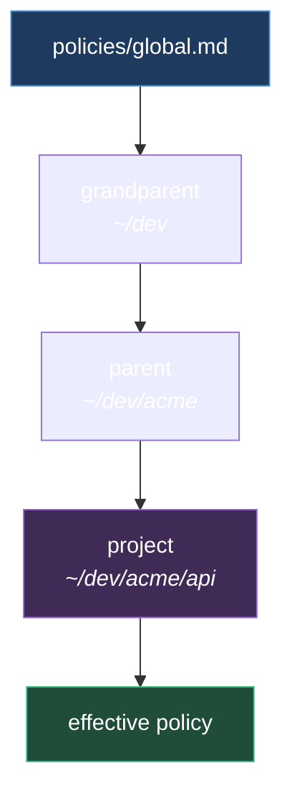

# Policy inheritance

Policies resolve by following the project's position on the filesystem: from the global root down to the most specific node.



## Merge rules

| Type | Behaviour |
|---|---|
| scalar | override — the most specific one wins |
| list | append + dedup, order preserved |
| map | recursive merge, key by key |
| `!final` | the value locks: descendants cannot redefine it |
| `!local` | the value applies to this node only, it does not propagate to children |
| `~key` | removes the inherited key |

Conflict between two `!final` on the same branch: the ancestor wins, and the descendant is flagged by `mem doctor`.

## Resolution

1. Start from the `cwd` and walk up the directory chain
2. Every directory matching a registered project's `path` contributes its `policy.md`
3. `policies/global.md` is always the first link
4. Inspect the result with `mem scope <path>`

```bash
python3 bin/mem.py scope ~/dev/acme/api
```

## Example

`global` imposes `commit.attribution: none !final` and `commit.granularity: feature`.
The `acme/api` project may take granularity down to `atomic`, but it cannot reintroduce attribution.

See also [[global]] · [[MEMORY]]
