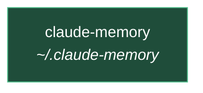

# Project graph

Generated by `mem graph`. Do not edit by hand.

<!-- mem:graph:start -->

<!-- mem:graph:end -->

## Registry

| project | path | parent | status | repo |
|---|---|---|---|---|
| [[claude-memory]] | `~/.claude-memory` | - | active | - |

See also [[MEMORY]] · [[inheritance]]
